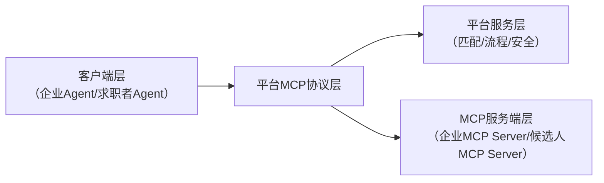

# Job Agent 系统 - 产品需求文档（PRD）

## 1. 产品概述

### 1.1 产品名称
**Job Agent 智能招聘匹配平台**

### 1.2 产品定位
基于 MCP（Model Context Protocol）协议构建的纯平台化求职招聘 Agent 服务，核心是平台提供标准接入协议，企业和候选人双方通过 MCP Server 方式接入，平台做供需匹配和流程调度，实现 "Agent 对 Agent" 的自主招聘求职全流程交互。

### 1.3 产品目标
- 打造 AI 招聘领域的协议枢纽和匹配中台
- 实现企业与候选人的高效智能匹配
- 构建标准化、可扩展的招聘生态系统

---

## 2. 核心价值主张

| 价值维度 | 描述 |
| :--- | :--- |
| **协议标准化** | 统一 MCP 接入规范，降低企业和候选人接入成本 |
| **智能匹配** | 基于大模型语义匹配+权重排序算法，提升匹配准确率 |
| **流程自动化** | 全流程由平台根据协议驱动双方 Agent 自动流转 |
| **数据安全** | 敏感数据脱敏处理，企业保留自身系统控制权 |
| **无缝集成** | 完全嵌入 AI 工作流，无需切换页面 |

---

## 3. 目标用户

### 3.1 企业用户
- **HR Agent**：企业招聘系统封装的 AI Agent
- **企业管理员**：负责配置企业 MCP Server 接入
- **招聘专员**：使用平台进行岗位发布和简历筛选

### 3.2 候选人用户
- **求职 Agent**：求职者个人求职 AI Agent
- **求职者**：通过求职 Agent 接入平台，获取岗位推荐

### 3.3 平台运营者
- **平台管理员**：管理平台配置、监控服务状态
- **算法工程师**：优化匹配算法和权重配置

---

## 4. 整体架构设计

### 4.1 架构层次

采用经典三层解耦架构，符合 MCP "通用转接头" 设计思想：

### 4.2 架构分层说明

| 层级 | 名称 | 职责 |
| :--- | :--- | :--- |
| 客户端层 | 企业 Agent / 求职者 Agent | 发起招聘/求职请求，接收匹配结果 |
| MCP 协议层 | 协议网关 | 标准化协议转换、请求路由、身份认证 |
| 平台服务层 | 核心服务集群 | 供需匹配、流程调度、安全管控 |
| MCP 服务端层 | 企业/候选人 MCP Server | 封装企业招聘系统、候选人简历数据 |

---

## 5. 核心功能需求

### 5.1 MCP 接入层

#### 5.1.1 企业接入规范

| 功能点 | 需求描述 | 接口定义 |
| :--- | :--- | :--- |
| 岗位列表获取 | 企业 MCP Server 暴露岗位列表接口 | `get_job_list(filter)` |
| 岗位详情获取 | 获取单个岗位详细信息 | `get_job_detail(job_id)` |
| 简历搜索 | 企业根据条件搜索候选人 | `search_resume(criteria)` |
| 招聘状态更新 | 更新招聘进度状态 | `update_recruitment_status(data)` |

#### 5.1.2 候选人接入规范

| 功能点 | 需求描述 | 接口定义 |
| :--- | :--- | :--- |
| 简历获取 | 候选人 Agent 暴露个人简历接口 | `get_profile()` |
| 求职意向更新 | 更新求职意向和偏好 | `update_job_intent(intent)` |
| 岗位申请 | 申请匹配的岗位 | `apply_job(job_id)` |
| 状态查询 | 查询申请进度状态 | `get_application_status()` |

### 5.2 供需匹配服务

| 功能点 | 需求描述 | 优先级 |
| :--- | :--- | :--- |
| 岗位画像构建 | 基于企业岗位信息构建结构化画像 | 高 |
| 候选人画像构建 | 基于简历信息构建候选人画像 | 高 |
| 语义匹配算法 | 大模型语义匹配 + 权重排序 | 高 |
| 双向推送 | 向企业推送候选人，向候选人推送岗位 | 高 |
| 匹配结果优化 | 根据反馈持续优化匹配算法 | 中 |

### 5.3 流程调度服务

| 功能点 | 需求描述 | 优先级 |
| :--- | :--- | :--- |
| 岗位发布同步 | 企业发布岗位后同步到平台 | 高 |
| 简历推送 | 向匹配企业推送候选人简历 | 高 |
| 初筛互动 | 企业 Agent 与候选人 Agent 自动初筛 | 高 |
| 面试协调 | 自动协调面试时间和安排 | 中 |
| 结果反馈 | 面试结果自动反馈给双方 | 高 |
| 断点续聊 | 支持流程中断后的继续 | 中 |
| 状态同步 | 实时同步双方状态变更 | 高 |

### 5.4 安全管控服务

| 功能点 | 需求描述 | 优先级 |
| :--- | :--- | :--- |
| 敏感数据脱敏 | 对企业联系方式、候选人手机号等脱敏 | 高 |
| 数据授权管理 | 仅在双方达成意向后授权开放敏感信息 | 高 |
| 合规校验 | 内置违规内容检测，过滤虚假岗位 | 高 |
| 身份认证 | 企业和候选人身份验证 | 高 |
| 访问日志 | 记录所有操作日志，便于审计 | 中 |

---

## 6. 非功能需求

### 6.1 性能需求

| 指标 | 要求 |
| :--- | :--- |
| 匹配响应时间 | < 3 秒 |
| 系统可用性 | ≥ 99.9% |
| 支持并发用户数 | ≥ 10000 |
| 数据同步延迟 | < 5 秒 |

### 6.2 安全性需求

| 需求 | 描述 |
| :--- | :--- |
| 数据加密 | 传输加密（HTTPS）、存储加密 |
| 访问控制 | 基于角色的权限管理（RBAC） |
| 敏感数据保护 | 脱敏处理、最小权限原则 |
| 安全审计 | 完整操作日志记录 |

### 6.3 可扩展性需求

| 需求 | 描述 |
| :--- | :--- |
| 水平扩展 | 支持服务水平扩展 |
| 多租户支持 | 支持多企业租户隔离 |
| 协议扩展 | 支持未来协议版本升级 |

---

## 7. 数据模型设计

### 7.1 岗位数据模型

| 字段名 | 类型 | 说明 |
| :--- | :--- | :--- |
| job_id | string | 岗位唯一标识 |
| company_id | string | 企业标识 |
| title | string | 岗位名称 |
| description | string | 岗位描述 |
| requirements | string | 任职要求 |
| location | string | 工作地点 |
| salary_range | string | 薪资范围 |
| tags | array | 岗位标签 |
| status | enum | 状态（open/closed） |
| created_at | datetime | 创建时间 |

### 7.2 候选人数据模型

| 字段名 | 类型 | 说明 |
| :--- | :--- | :--- |
| candidate_id | string | 候选人唯一标识 |
| name | string | 姓名（脱敏） |
| phone | string | 手机号（脱敏） |
| email | string | 邮箱（脱敏） |
| resume_text | string | 简历内容 |
| skills | array | 技能标签 |
| experience | string | 工作经验 |
| education | string | 学历 |
| job_intent | object | 求职意向 |
| created_at | datetime | 创建时间 |

### 7.3 匹配结果模型

| 字段名 | 类型 | 说明 |
| :--- | :--- | :--- |
| match_id | string | 匹配记录唯一标识 |
| job_id | string | 岗位标识 |
| candidate_id | string | 候选人标识 |
| score | float | 匹配分数（0-1） |
| match_reasons | array | 匹配理由 |
| status | enum | 状态（pending/accepted/rejected） |
| created_at | datetime | 创建时间 |

---

## 8. 项目分工规划

| 分工模块 | 核心职责 | 对应产出 |
| :--- | :--- | :--- |
| 架构与协议组 | 定义平台 MCP 接入规范、设计整体分层架构、适配主流 MCP SDK | MCP 接入文档、整体架构设计图 |
| 平台服务后端组 | 开发匹配引擎、流程调度系统、安全管控模块，对接企业/候选人 MCP Server | 平台核心后端服务、API 接口文档 |
| MCP 示例开发组 | 开发标准企业接入 MCP Server 示例、候选人 Agent 接入 MCP Server 示例 | 接入 Demo 代码、接入教程 |
| 匹配算法组 | 优化岗位-候选人语义匹配算法，调整匹配维度权重 | 匹配算法模型、在线匹配服务 |
| 测试与文档组 | 验证接入流程正确性、做兼容性测试，输出完整平台接入文档与使用指南 | 测试报告、官方接入文档 |

---

## 9. 差异化优势

| 对比维度 | 传统招聘平台 | 本 MCP 纯平台方案 |
| :--- | :--- | :--- |
| 集成体验 | 必须跳转平台官网/APP，打断原有工作流 | 完全嵌入 AI 工作流，企业可在 Claude/Cursor 等现有 AI 环境直接发起招聘 |
| 扩展能力 | 接入新企业/第三方系统需要定制开发 | MCP 标准化接入，即插即用，动态扩展 |
| 自主性 | 平台管控全流程，企业自主性弱 | 企业保留自身招聘系统控制权，数据安全可控 |
| 扩展成本 | 高，需定制开发 | 降低 40% 以上 |

---

## 10. 风险评估

| 风险点 | 描述 | 影响程度 | 缓解措施 |
| :--- | :--- | :--- | :--- |
| MCP 协议成熟度 | MCP 协议尚处于发展阶段，可能存在兼容性问题 | 中 | 选择成熟的 MCP SDK，建立协议适配层 |
| 企业接入意愿 | 企业可能对新技术持观望态度 | 中 | 提供完善的接入文档和示例代码，降低接入门槛 |
| 数据安全顾虑 | 企业担心数据泄露 | 高 | 强化数据脱敏和安全管控，提供数据安全白皮书 |
| 匹配准确率 | 初期匹配算法可能不够精准 | 中 | 建立反馈机制，持续优化算法模型 |

---

## 11. 附录

### 11.1 参考资料
- [谷歌版 MCP 来了:Agent2Agent 协议,实现跨平台 AI Agent 互联](https://hub.baai.ac.cn/view/44810)
- [企业级 AI Agent SaaS 服务平台设计方案和开源项目选型补充说明](https://zhuanlan.zhihu.com/p/2044814495638451338)
- [基于 MCP 协议构建 AI 原生招聘市场:RevolutionAI 技术解析与实践](https://blog.csdn.net/weixin_30613343/article/details/96588460)

### 11.2 版本历史

| 版本 | 日期 | 修改内容 | 作者 |
| :--- | :--- | :--- | :--- |
| v1.0 | 2026-06-12 | 初始版本 | Product Team |

